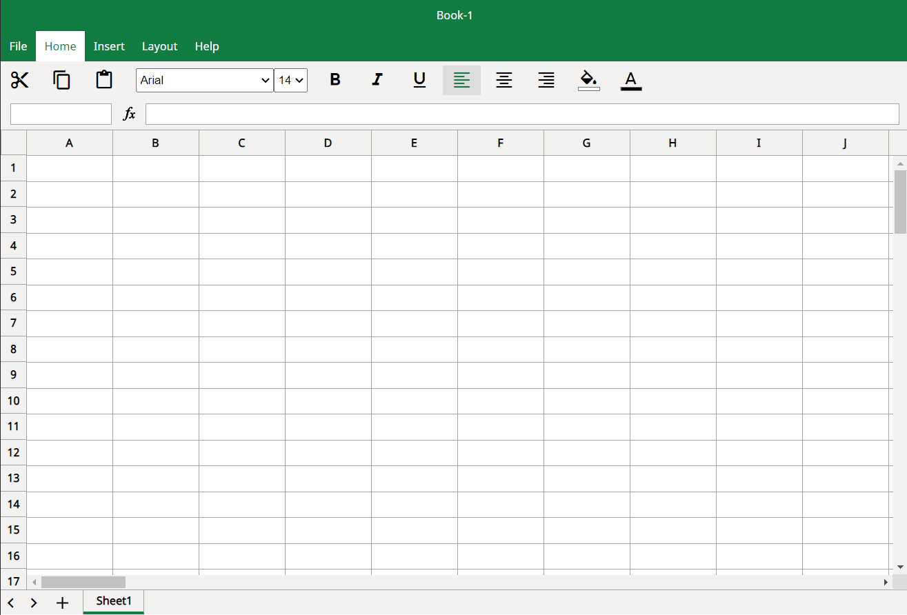

# Excel Clone

Welcome to Excel Clone. As the name suggests, this is clone of MS Excel. 
hosted here: [iamrnkk.github.io/excel-clone/](iamrnkk.github.io/excel-clone/)

## Features

* <strong>Basic:</strong> Type numbers or text in Cells.
* <strong>Formatting:</strong> Apply formatting by Selecting the cells and picking up formatting options from Menu Icon Bar.
* <strong>Multiple Select:</strong> Select multiple Cells by pressing and holding ctrl key.
* <strong>Add Sheets:</strong> Add more sheets by clicking on + in sheet Bar.
* <strong>Rename/Delete Sheets:</strong> Right click on sheet to do the needful.
* <strong>Formula:</strong> Compute basic mathematical expressions on cell by typing formula in Formula Bar. format: (2*A1 + 3/B1) where A1 and B1 are cell-addresses.